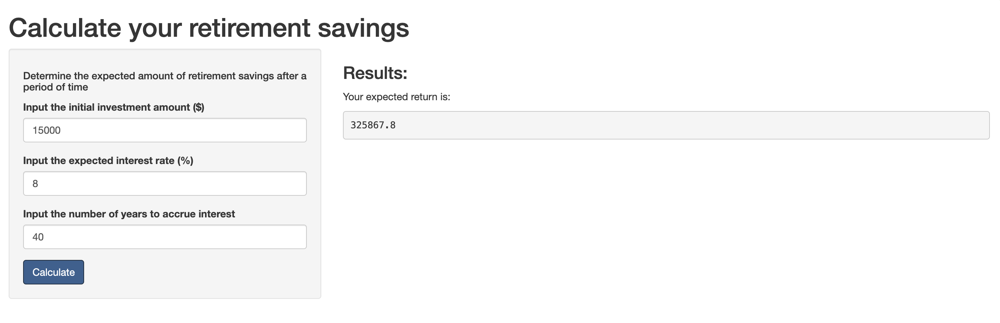

```{r setup, include=FALSE}
knitr::opts_chunk$set(echo = FALSE)
```

## Coursera Week 5 Project - Reproducible Pitch

This peer assessed assignment has two parts. First, you will create a Shiny application and deploy it on Rstudio's servers. Second, you will use Slidify or Rstudio Presenter to prepare a reproducible pitch presentation about your application.

The created application can be tested here:
https://buckets265.shinyapps.io/Compound_Interest_Calculator/

The code for the app is available here:
https://github.com/Buckets2510/Data-Products-Week-3-Project.git

A simple compound interest calculator was created for a user to enter a principal amount and view the anticipated value after the user enters an interest rate and period of time.

## Project Overview
The application allows the user to estimate the value of an initial amount and the anticipated account value after a period of time. The application allows the user to enter the following data:

1. Initial amount - current balance of the investment account
2. Interest rate - anticipated interest rate for the compound period
3. Years - anticipated number of years the user plans to save

## UI Code
Below is the code for the application interface. For presentation purposes, values will be set for 'Initial', 'Interest', and 'years', in order to demonstrate the output at the end of the presentation
```{r, echo = TRUE}
library(shiny)

shinyUI(pageWithSidebar(
        headerPanel("Calculate your retirement savings"),
        sidebarPanel(
                h5("Determine the expected amount of retirement savings after a period of time"),
                numericInput("initial", "Input the initial investment amount ($)", value = 15000),
                numericInput("interest", "Input the expected interest rate (%)", value = 8),
                numericInput("years", "Input the number of years to accrue interest", value = 40),
                submitButton("Calculate")
        ),
        mainPanel(
                h3("Results:"),
                p("Your expected return is:"),
                verbatimTextOutput("income")
        )
))
```

## Server code
```{r, echo = TRUE}
library(shiny)

incomefunc <- function(initial, interest, years){
        income <- round((initial * (1+(interest/100)/1)^(years)), digits = 1)
}

shinyServer(
        function(input,output){
                output$income <- renderText({incomefunc(input$initial, input$interest, input$years)})
        }
)
```

## Application output
<center></center>